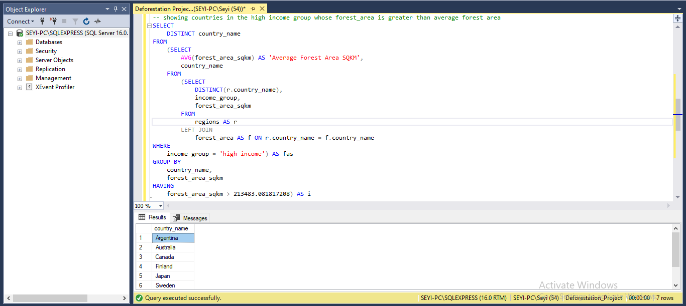

## INTRODUCTION
Global deforestation has been a contributing factor to climate change, where carbon is released into the atmosphere from the cutting down or burning of trees. These trees serve as stores for carbon which helps to stabilise the planet's atmosphere, cutting down or burning these trees releases carbon into the atmosphere as carbon dioxide. Deforestation occurs primarily in areas with large forest areas such as the Amazon Basin of South America, the Congo Basin in Central Africa and also Southeast Asia, reasons for deforestation around each of these region differs but can range from the clearing of forest for agricultural products, cultivation, urbanization etc. 
## PROBLEM STATEMENT
The objective of the analysis is to get insight into the similar features and characteristics of companies involved in deforestation such as their total land area, forest area, country's income group and their region. These features and patterns are helpful in helping us determine the country that might be most involved in deforestation and provide insight into the factors that might influenced the rate of deforestation in each of these countries.
## UNDERSTANDING THE DATASET 
The dataset provided shows the land area and forest area of each country from 1990 up till 2016, it is made up of 3 tables which are; the forest area, the regions, and the land area. The forest area table consists of 4 columns (country code, country name, year and the forest area in square kilometres) and 5886 rows of data, the regions table is made up of 4 columns (country name, country code, region and income group) and 219 rows of data, and finally, the land area is made up of 4 columns (country code, country name, year and total land area in square miles) and 5886 rows of data.
- Country code; This column shows the shortcode for each country.
- Country name; This column shows the name of each country.
- Region; This shows the region in which each country is located
- Year; This shows the land area and forest area for each country between 1990 and 2016
- Forest area; This shows the forest area for each country in square kilometres
- Total area; This shows the total area for each country in square miles
## QUESTIONS AND ANSWERS
### TOTAL NUMBER OF COUNTRIES INVOLVED IN DEFORESTATION

Across the globe, we have a total of 218 countries involved in deforestation. The dataset contained multiple instances of each country, so I used the **DISTINCT** function to count only one occurrence of each country from the land area table.
### INCOME GROUP OF COUNTRIES WITH TOTAL AREA RANGING FROM 75,000 TO 150,000

We want to examine if the income group of countries with a total area ranging from 75,000 to 150,000 would be a factor as to why they would be involved in deforestation. From our observation, of all the countries with total area ranging from 75,000 to 150,000, **Zimbabwe** was the country with the largest land area falling under the **Low-Income** group, and from further observations, we can see that countries from the **Sub-Saharan Africa** within this total area range fall within the **Low-Income** and **Lower-Middle-Income** group. This insight tells us that within the **Sub-Saharan** we have more poor countries that would clear trees to make way for urbanization or production of agricultural produce to improve their country's economies.
### 

