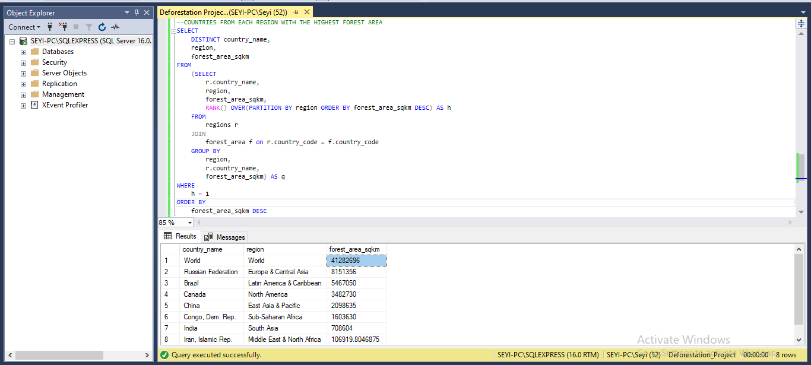

## INTRODUCTION
Global deforestation has been a contributing factor to climate change, where carbon is released into the atmosphere from the cutting down or burning of trees. These trees serve as stores for carbon which helps to stabilise the planet's atmosphere, cutting down or burning these trees releases carbon into the atmosphere as carbon dioxide. Deforestation occurs primarily in areas with large forest areas such as the Amazon Basin of South America, the Congo Basin in Central Africa and Southeast Asia, The reasons for deforestation around each of these region differs but can range from the clearing of forest for agricultural products, cultivation, urbanization etc. 
## PROBLEM STATEMENT
The objective of the analysis is to get insight into the similar features and characteristics of companies involved in deforestation such as their total land area, forest area, country's income group and their region. These features and patterns are helpful in helping us determine the country that might be most involved in deforestation and provide insight into the factors that might influenced the rate of deforestation in each of these countries.
## UNDERSTANDING THE DATASET 
The dataset provided shows the land area and forest area of each country from 1990 up till 2016, it is made up of 3 tables which are; the forest area, the regions, and the land area. The forest area table consists of 4 columns (country code, country name, year and the forest area in square kilometres) and 5886 rows of data, The regions table is made up of 4 columns (country name, country code, region and income group) and 219 rows of data, and finally, the land area is made up of 4 columns (country code, country name, year and total land area in square miles) and 5886 rows of data.
- Country code; This column shows the shortcode for each country.
- Country name; This column shows the name of each country.
- Region; This shows the region in which each country is located
- Year; This shows the land area and forest area for each country between 1990 and 2016
- Forest area; This shows the forest area for each country in square kilometres
- Total area; This shows the total area for each country in square miles
## QUESTIONS AND ANSWERS
### TOTAL NUMBER OF COUNTRIES INVOLVED IN DEFORESTATION

Across the globe, we have a total of 218 countries involved in deforestation. The dataset contained multiple instances of each country, so I used the **DISTINCT** function to count only one occurrence of each country from the land area table.
### INCOME GROUP OF COUNTRIES WITH TOTAL AREA RANGING FROM 75,000 TO 150,000

There is a total of 25 countries with a total area ranging from 75,000 to 150,000, we want to examine if the income group of countries with a total area ranging from 75,000 to 150,000 would be a factor as to why they would be involved in deforestation. From our observation, of all the countries with total area ranging from 75,000 to 150,000, **Zimbabwe** was the country with the largest land area falling under the **Low-Income** group, and from further observations, we can see that countries from the **Sub-Saharan Africa** within this total area range fall within the **Low-Income** and **Lower-Middle-Income** group. This insight tells us that within the **Sub-Saharan** we have more poor countries that would clear trees to make way for urbanization or production of agricultural produce to improve their country's economies.
### COUNTRIES WITH A FOREST AREA GREATER THAN THE AVERAGE FOREST AREA OF ALL COUNTRIES IN THE HIGH-INCOME GROUP

31 countries have a forest area greater than that of the average forest area of all countries in the high-income group. Out of these 31 countries, we have 5 countries in the **Low-Income** group, 9 in the **Lower-Middle Income** group, 9 in the **Upper-Middle Income** group, and 7 in the **High Income** group. Further observation shows that the **Low-Income** group of these countries is populated by countries in the **Sub-Saharan** region of the country. 
### AVERAGE TOTAL AREA(SQM) OF COUNTRIES IN THE UPPER MIDDLE-INCOME GROUP AND COMPARING THEM WITH THE OTHER INCOME GROUP

The average total area for countries in each income group is as follows; Upper-Middle Income; **1,073,422.13076289**, Lower-Middle Income; **157,940.361340573**, High-Income; **141,206.473337901** and Low-Income; **152,892.738583519**. Comparing all of these average total areas, countries in the **UPPER-MIDDLE** income group have the highest average total area.
### TOTAL FOREST AREA FOR COUNTRIES IN THE HIGH-INCOME GROUP AND COMPARING THEM WITH OTHER INCOME GROUP 

The total forest area for countries in each income group is given as follows; High Income; **274,539,243.216929**, Low-Income; **103,298,851.226532**, Upper-Middle Income; **518,710,039.885185**, Lower-Middle Income; **156,802,355.387207**. Upon making the comparison between these income groups and their total forest area, we can see that countries in the **UPPER-MIDDLE** income have the largest total forest areas.
### COUNTRIES FROM EACH REGION HAVING THE HIGHEST TOTAL FOREST AREA

Across the dataset, we have a total of 8 regions. Out of all the regions, the world region has the highest total forest area followed by **The Russian Federation** from the **Europe & Central Asia** region, amassing a total forest area of **8,151,356 SQKM** and the country with the least forest area is the **Iran, Islamic Rep** from the **Middle East & North Africa** region. Iran has the least total forest area due to it being located in the desert region.
## CONCLUSION
